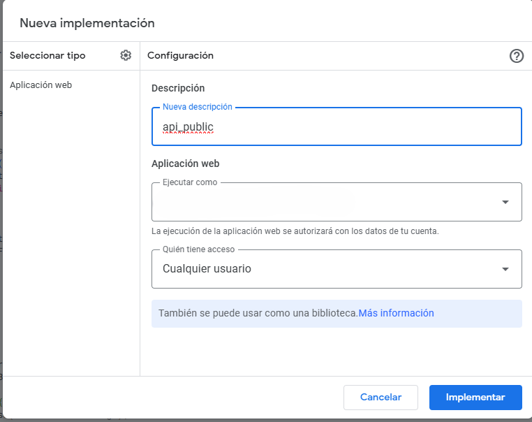
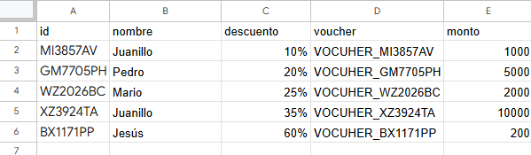
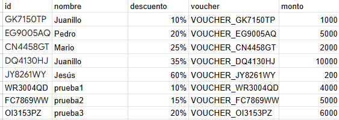
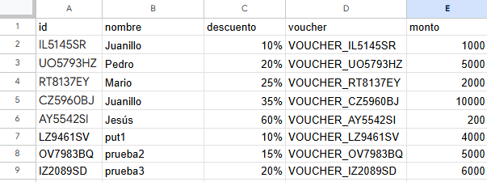
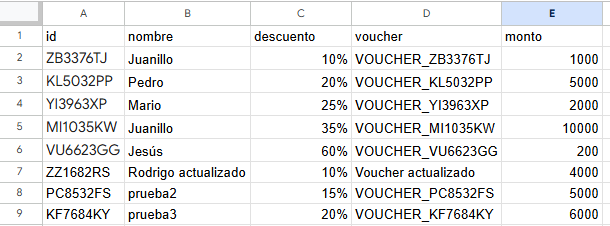

# API Google Sheet

Creación de API de Google Sheet con Google App Script.


## Estructura Tabla Gsheet

| id        | nombre   | descuento | voucher            | monto  |
|-----------|----------|-----------|---------------------|--------|
| AF5326RG  | Juanillo | 10%       | VOCUHER_AF5326RG    | 1000   |
| AL2300PS  | Pedro    | 20%       | VOCUHER_AL2300PS    | 5000   |
| RS9708GQ  | Mario    | 25%       | VOCUHER_RS9708GQ    | 2000   |
| AG8279TB  | Juanillo | 35%       | VOCUHER_AG8279TB    | 10000  |
| ON2087CO  | Jesús    | 60%       | VOCUHER_ON2087CO    | 200    |

## Google app Script API GET/POST/PUT/PATCH
```js
// Función para verificar el nombre de la hoja y devolver la hoja si existe
function getSheetByName(sheetName) {
  if (!sheetName) {
    return { success: false, message: "No se ha proporcionado el nombre de la hoja." };
  }

  var sheet = SpreadsheetApp.getActiveSpreadsheet().getSheetByName(sheetName);
  if (!sheet) {
    return { success: false, message: "La hoja '" + sheetName + "' no existe." };
  }

  return { success: true, sheet: sheet };
}

// Función para crear respuestas de error
function createErrorResponse(message) {
  return ContentService.createTextOutput("Error: " + message)
    .setMimeType(ContentService.MimeType.TEXT);
}

// Función para validar JSON
function validateJson(jsonData, requiredFields) {
  for (var field of requiredFields) {
    if (!jsonData[field]) {
      return `Falta el campo '${field}' en el JSON.`;
    }
  }
  return null;
}

function doGet(e) {
  var sheetName = e.parameter.sheetName;
  var sheetResult = getSheetByName(sheetName);

  if (!sheetResult.success) {
    return createErrorResponse(sheetResult.message);
  }

  var sheet = sheetResult.sheet;
  var range = sheet.getDataRange();
  var values = range.getValues();

  if (values.length < 2) {
    return createErrorResponse("La hoja no tiene suficientes datos.");
  }

  var headers = values[0]; // Interpretar la fila 1 como los nombres de las columnas
  var jsonData = [];
  var filters = {};

  // Crear filtros basados en los parámetros de la solicitud
  for (var param in e.parameter) {
    if (param !== "sheetName" && headers.includes(param)) {
      filters[param] = e.parameter[param];
    }
  }

  // Filtrar los datos basados en los parámetros
  for (var i = 1; i < values.length; i++) {
    var rowData = {};
    var match = true;

    for (var j = 0; j < headers.length; j++) {
      rowData[headers[j]] = values[i][j];
    }

    for (var column in filters) {
      if (rowData[column] != filters[column]) {
        match = false;
        break;
      }
    }

    if (match) {
      jsonData.push(rowData);
    }
  }

  return ContentService.createTextOutput(JSON.stringify(jsonData))
    .setMimeType(ContentService.MimeType.JSON);
}

function doPost(e) {
  var method = e.parameter._method ? e.parameter._method.toUpperCase() : "POST";
  var sheetName = e.parameter.sheetName;
  var sheetResult = getSheetByName(sheetName);

  if (!sheetResult.success) {
    return createErrorResponse(sheetResult.message);
  }

  var sheet = sheetResult.sheet;

  if (method === "PUT") {
    return handlePut(e, sheet);
  } else if (method === "PATCH") {
    return handlePatch(e, sheet);
  } else if (method === "DELETE") {
    return handleDelete(e, sheet);
  } else {
    return handlePost(e, sheet);
  }
}

// Función para manejar el método POST normal
function handlePost(e, sheet) {
  var requestBody = e.postData.contents;
  var jsonData;

  try {
    jsonData = JSON.parse(requestBody); 
  } catch (error) {
    return createErrorResponse("El cuerpo de la solicitud no es un JSON válido.");
  }

  if (!jsonData.updates || !Array.isArray(jsonData.updates)) {
    return createErrorResponse("El cuerpo JSON debe contener un array 'updates'.");
  }

  var errores = [];
  var dataToSet = [];

  jsonData.updates.forEach(function(update) {
    var row = update.row;
    var values = update.values;
    if (row && values && Array.isArray(values)) {
      dataToSet.push({ row, values });
    }
  });

  dataToSet.sort((a, b) => a.row - b.row);

  try {
    dataToSet.forEach(function(item) {
      var range = sheet.getRange(item.row, 1, 1, item.values.length);
      range.setValues([item.values]);
    });
  } catch (error) {
    return createErrorResponse("Error al actualizar las filas en batch: " + error.message);
  }

  return ContentService.createTextOutput("Actualización exitosa de las filas.")
    .setMimeType(ContentService.MimeType.TEXT);
}

// Función para manejar el método PUT
function handlePut(e, sheet) {
  var requestBody = e.postData.contents;
  var jsonData;

  try {
    jsonData = JSON.parse(requestBody);
  } catch (error) {
    return createErrorResponse("El cuerpo de la solicitud no es un JSON válido.");
  }

  var validationError = validateJson(jsonData, ['row', 'values']);
  if (validationError) {
    return createErrorResponse(validationError);
  }

  var row = jsonData.row;
  var values = jsonData.values;

  try {
    var range = sheet.getRange(row, 1, 1, values.length);
    range.setValues([values]); 
  } catch (error) {
    return createErrorResponse("Error al actualizar la fila: " + error.message);
  }

  return ContentService.createTextOutput("Fila " + row + " reemplazada correctamente.")
    .setMimeType(ContentService.MimeType.TEXT);
}

// Función para manejar el método PATCH
function handlePatch(e, sheet) {
  var requestBody = e.postData.contents;
  var jsonData;

  try {
    jsonData = JSON.parse(requestBody);
  } catch (error) {
    return createErrorResponse("El cuerpo de la solicitud no es un JSON válido.");
  }

  var validationError = validateJson(jsonData, ['row', 'updates']);
  if (validationError) {
    return createErrorResponse(validationError);
  }

  var row = jsonData.row;
  var updates = jsonData.updates;
  var errores = [];

  updates.forEach(function(update) {
    var column = update.column;
    var value = update.value;

    if (!column || value === undefined) {
      errores.push("Faltan 'column' o 'value' en la actualización.");
      return;
    }

    try {
      sheet.getRange(row, column).setValue(value);
    } catch (error) {
      errores.push("Error al actualizar columna " + column + " en la fila " + row + ": " + error.message);
    }
  });

  if (errores.length > 0) {
    return createErrorResponse(errores.join(", "));
  }

  return ContentService.createTextOutput("Fila " + row + " actualizada parcialmente.")
    .setMimeType(ContentService.MimeType.TEXT);
}

// Función para manejar el método DELETE
function handleDelete(e, sheet) {
  var requestBody = e.postData.contents;
  var jsonData;

  try {
    jsonData = JSON.parse(requestBody);
  } catch (error) {
    return createErrorResponse("El cuerpo de la solicitud no es un JSON válido.");
  }

  var validationError = validateJson(jsonData, ['rows']);
  if (validationError) {
    return createErrorResponse(validationError);
  }

  var rows = jsonData.rows;
  var errores = [];

  rows.sort((a, b) => b - a); 

  rows.forEach(function(row) {
    try {
      sheet.deleteRow(row);
    } catch (error) {
      errores.push("Error al eliminar la fila " + row + ": " + error.message);
    }
  });

  if (errores.length > 0) {
    return createErrorResponse(errores.join(", "));
  }

  return ContentService.createTextOutput("Filas eliminadas correctamente.")
    .setMimeType(ContentService.MimeType.TEXT);
}
```
## Resumen de Funciones de la API

### Función Principal: `doGet(e)`
Maneja solicitudes GET para recuperar datos de una hoja de cálculo específica, permitiendo aplicar filtros opcionales basados en los encabezados.

- **Parámetros de entrada:**
  - `sheetName`: Nombre de la hoja de cálculo.
  - Otros parámetros que coincidan con los encabezados para filtrar.

- **Salida:**
  - JSON con las filas filtradas o un mensaje de error si la hoja no existe o tiene pocos datos.

### Función Principal: `doPost(e)`
Maneja solicitudes POST y métodos extendidos (PUT, PATCH, DELETE) con el parámetro `_method`.

#### Subfunciones:

- **`handlePost(e, sheet)`**
  - Actualiza múltiples filas con datos de un array `updates`.
  - **Entrada:** JSON con `row` y `values`.
  - **Salida:** Mensaje de éxito o error.

- **`handlePut(e, sheet)`**
  - Reemplaza una fila específica.
  - **Entrada:** JSON con `row` y `values`.
  - **Salida:** Mensaje de éxito o error.

- **`handlePatch(e, sheet)`**
  - Actualiza columnas específicas de una fila.
  - **Entrada:** JSON con `row` y `updates` (objeto con `column` y `value`).
  - **Salida:** Mensaje de éxito o listado de errores.

- **`handleDelete(e, sheet)`**
  - Elimina múltiples filas.
  - **Entrada:** JSON con array `rows`.
  - **Salida:** Mensaje de éxito o errores.

## Funciones de Soporte

- **`getSheetByName(sheetName)`**
  - Verifica y devuelve la hoja de cálculo por su nombre.
  - **Entrada:** Nombre de la hoja.
  - **Salida:** Objeto de la hoja o mensaje de error.

- **`createErrorResponse(message)`**
  - Genera un mensaje de error.
  - **Entrada:** Mensaje de error.
  - **Salida:** Respuesta de texto.

- **`validateJson(jsonData, requiredFields)`**
  - Verifica que el JSON contenga campos requeridos.
  - **Entrada:** `jsonData` y `requiredFields`.
  - **Salida:** `null` o mensaje de error.

## Implementar la API del Google App Script como Aplicación Web (No segura)



## Test API Postman



### GET
https://script.google.com/macros/s/ID_DEL_SCRIPT/exec?sheetName=Descuentos&nombre=Juanillo&descuento=0.35

#### Response

```json
[
    {
        "id": "MI6551VD",
        "nombre": "Juanillo",
        "descuento": 0.35,
        "voucher": "VOCUHER_MI6551VD",
        "monto": 10000,
        "": "",
        "*": ""
    }
]
```

### POST
https://script.google.com/macros/s/ID_DEL_SCRIPT/exec?sheetName=Descuentos

Body
```json
{
  "updates": [
    {
      "row": 7,
      "values": [
        "=IF(B7<>\"\"; CHAR(RANDBETWEEN(65; 90)) & CHAR(RANDBETWEEN(65; 90)) & RANDBETWEEN(1000; 9999) & CHAR(RANDBETWEEN(65; 90)) & CHAR(RANDBETWEEN(65; 90)); \"\")",
        "prueba1",
        "10%",
        "=CONCAT(\"VOUCHER_\"; A7)",
        "4000"
      ]
    },
    {
      "row": 8,
      "values": [
        "=IF(B8<>\"\"; CHAR(RANDBETWEEN(65; 90)) & CHAR(RANDBETWEEN(65; 90)) & RANDBETWEEN(1000; 9999) & CHAR(RANDBETWEEN(65; 90)) & CHAR(RANDBETWEEN(65; 90)); \"\")",
        "prueba2",
        "15%",
        "=CONCAT(\"VOUCHER_\"; A8)",
        "5000"
      ]
    },
    {
      "row": 9,
      "values": [
        "=IF(B9<>\"\"; CHAR(RANDBETWEEN(65; 90)) & CHAR(RANDBETWEEN(65; 90)) & RANDBETWEEN(1000; 9999) & CHAR(RANDBETWEEN(65; 90)) & CHAR(RANDBETWEEN(65; 90)); \"\")",
        "prueba3",
        "20%",
        "=CONCAT(\"VOUCHER_\"; A9)",
        "6000"
      ]
    }
  ]
}

```
#### Response:

Actualización exitosa de las filas.



### PUT
Utilizamos el método POST para PUT
https://script.google.com/macros/s/ID_DEL_SCRIPT/exec?sheetName=Descuentos&_method=PUT

Body

```json
{
  "row": 7,
  "values": [
    "=IF(B7<>\"\"; CHAR(RANDBETWEEN(65; 90)) & CHAR(RANDBETWEEN(65; 90)) & RANDBETWEEN(1000; 9999) & CHAR(RANDBETWEEN(65; 90)) & CHAR(RANDBETWEEN(65; 90)); \"\")",
    "put1",
    "10%",
    "=CONCAT(\"VOUCHER_\"; A7)",
    "4000"
  ]
}
```
#### Response:

Fila 7 reemplazada correctamente.



### PATCH
Utilizamos el método POST para PATCH
https://script.google.com/macros/s/ID_DEL_SCRIPT/exec?sheetName=Descuentos&_method=PATCH

Body

```json
{
  "row": 7,
  "updates": [
    { "column": 2, "value": "Rodrigo actualizado" },
    { "column": 4, "value": "Voucher actualizado" }
  ]
}

```
#### Response:

Fila 7 actualizada parcialmente.



### DELETE
Utilizamos el método POST para DELETE
https://script.google.com/macros/s/ID_DEL_SCRIPT/exec?sheetName=Descuentos&_method=DELETE

Body
```json
{
  "rows": [7, 8, 9]
}

```
#### Response:

Filas eliminadas correctamente.


## Test yourself

- API url: https://script.google.com/macros/s/AKfycbyqiMvu6qdTVmW810OhIlBr64dorwnZ4P3J0IVcdtg42j5MVlc_n_xfbD3zKUt1qiX1_g/exec
- Goggle Sheet: https://docs.google.com/spreadsheets/d/14llC6typtarV5c5SKvwjN8yiQufknJyGODW4r_5kroI/edit?usp=sharing

## Authors

- [@juanmonforte](https://github.com/juanmonforte)


## 🔗 Links
[](https://github.com/juanmonforte/portfolio)
[](https://www.linkedin.com/in/juanmonfortedelahuerga/)