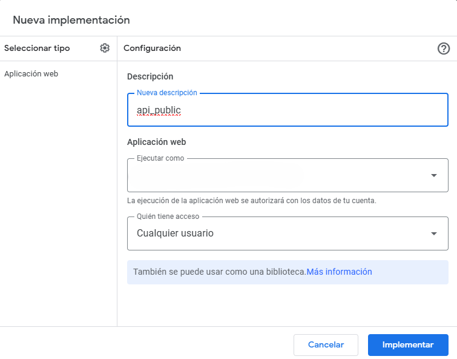

# API Google Sheet

Creación de API de Google Sheet con Google App Script.


## Estructura Tabla Gsheet

| id        | nombre   | descuento | voucher            | monto  |
|-----------|----------|-----------|---------------------|--------|
| AF5326RG  | Juanillo | 10%       | VOCUHER_AF5326RG    | 1000   |
| AL2300PS  | Pedro    | 20%       | VOCUHER_AL2300PS    | 5000   |
| RS9708GQ  | Mario    | 25%       | VOCUHER_RS9708GQ    | 2000   |
| AG8279TB  | Juanillo | 35%       | VOCUHER_AG8279TB    | 10000  |
| ON2087CO  | Jesús    | 60%       | VOCUHER_ON2087CO    | 200    |

## Resumen de Funciones de la API

### Función Principal: `doGet(e)`
Maneja solicitudes GET para recuperar datos de una hoja de cálculo específica, permitiendo aplicar filtros opcionales basados en los encabezados.

- **Parámetros de entrada:**
  - `sheetName`: Nombre de la hoja de cálculo.
  - Otros parámetros que coincidan con los encabezados para filtrar.

- **Salida:**
  - JSON con las filas filtradas o un mensaje de error si la hoja no existe o tiene pocos datos.

### Función Principal: `doPost(e)`
Maneja solicitudes POST y métodos extendidos (PUT, PATCH, DELETE) con el parámetro `_method`.

#### Subfunciones:

- **`handlePost(e, sheet)`**
  - Actualiza múltiples filas con datos de un array `updates`.
  - **Entrada:** JSON con `row` y `values`.
  - **Salida:** Mensaje de éxito o error.

- **`handlePut(e, sheet)`**
  - Reemplaza una fila específica.
  - **Entrada:** JSON con `row` y `values`.
  - **Salida:** Mensaje de éxito o error.

- **`handlePatch(e, sheet)`**
  - Actualiza columnas específicas de una fila.
  - **Entrada:** JSON con `row` y `updates` (objeto con `column` y `value`).
  - **Salida:** Mensaje de éxito o listado de errores.

- **`handleDelete(e, sheet)`**
  - Elimina múltiples filas.
  - **Entrada:** JSON con array `rows`.
  - **Salida:** Mensaje de éxito o errores.

## Funciones de Soporte

- **`getSheetByName(sheetName)`**
  - Verifica y devuelve la hoja de cálculo por su nombre.
  - **Entrada:** Nombre de la hoja.
  - **Salida:** Objeto de la hoja o mensaje de error.

- **`createErrorResponse(message)`**
  - Genera un mensaje de error.
  - **Entrada:** Mensaje de error.
  - **Salida:** Respuesta de texto.

- **`validateJson(jsonData, requiredFields)`**
  - Verifica que el JSON contenga campos requeridos.
  - **Entrada:** `jsonData` y `requiredFields`.
  - **Salida:** `null` o mensaje de error.

## Implementar la API del Google App Script como Aplicación Web (No segura)



## Test API Postman


### GET
https://script.google.com/macros/s/ID_DEL_SCRIPT/exec?sheetName=Descuentos&nombre=Juanillo&descuento=0.35

#### Response

```json
[
    {
        "id": "MI6551VD",
        "nombre": "Juanillo",
        "descuento": 0.35,
        "voucher": "VOCUHER_MI6551VD",
        "monto": 10000,
        "": "",
        "*": ""
    }
]
```

### POST
https://script.google.com/macros/s/ID_DEL_SCRIPT/exec?sheetName=Descuentos

Body
```json
{
  "updates": [
    {
      "row": 7,
      "values": [
        "=IF(B7<>\"\"; CHAR(RANDBETWEEN(65; 90)) & CHAR(RANDBETWEEN(65; 90)) & RANDBETWEEN(1000; 9999) & CHAR(RANDBETWEEN(65; 90)) & CHAR(RANDBETWEEN(65; 90)); \"\")",
        "prueba1",
        "10%",
        "=CONCAT(\"VOUCHER_\"; A7)",
        "4000"
      ]
    },
    {
      "row": 8,
      "values": [
        "=IF(B8<>\"\"; CHAR(RANDBETWEEN(65; 90)) & CHAR(RANDBETWEEN(65; 90)) & RANDBETWEEN(1000; 9999) & CHAR(RANDBETWEEN(65; 90)) & CHAR(RANDBETWEEN(65; 90)); \"\")",
        "prueba2",
        "15%",
        "=CONCAT(\"VOUCHER_\"; A8)",
        "5000"
      ]
    },
    {
      "row": 9,
      "values": [
        "=IF(B9<>\"\"; CHAR(RANDBETWEEN(65; 90)) & CHAR(RANDBETWEEN(65; 90)) & RANDBETWEEN(1000; 9999) & CHAR(RANDBETWEEN(65; 90)) & CHAR(RANDBETWEEN(65; 90)); \"\")",
        "prueba3",
        "20%",
        "=CONCAT(\"VOUCHER_\"; A9)",
        "6000"
      ]
    }
  ]
}

```
#### Response:

Actualización exitosa de las filas.


### PUT
Utilizamos el método POST para PUT
https://script.google.com/macros/s/ID_DEL_SCRIPT/exec?sheetName=Descuentos&_method=PUT

Body

```json
{
  "row": 7,
  "values": [
    "=IF(B7<>\"\"; CHAR(RANDBETWEEN(65; 90)) & CHAR(RANDBETWEEN(65; 90)) & RANDBETWEEN(1000; 9999) & CHAR(RANDBETWEEN(65; 90)) & CHAR(RANDBETWEEN(65; 90)); \"\")",
    "put1",
    "10%",
    "=CONCAT(\"VOUCHER_\"; A7)",
    "4000"
  ]
}
```
#### Response:

Fila 7 reemplazada correctamente.


### PATCH
Utilizamos el método POST para PATCH
https://script.google.com/macros/s/ID_DEL_SCRIPT/exec?sheetName=Descuentos&_method=PATCH

Body

```json
{
  "row": 7,
  "updates": [
    { "column": 2, "value": "Rodrigo actualizado" },
    { "column": 4, "value": "Voucher actualizado" }
  ]
}

```
#### Response:

Fila 7 actualizada parcialmente.


### DELETE
Utilizamos el método POST para DELETE
https://script.google.com/macros/s/ID_DEL_SCRIPT/exec?sheetName=Descuentos&_method=DELETE

Body
```json
{
  "rows": [7, 8, 9]
}

```
#### Response:

Filas eliminadas correctamente.


## Test yourself

- API url: https://script.google.com/macros/s/AKfycbyqiMvu6qdTVmW810OhIlBr64dorwnZ4P3J0IVcdtg42j5MVlc_n_xfbD3zKUt1qiX1_g/exec
- Goggle Sheet: https://docs.google.com/spreadsheets/d/14llC6typtarV5c5SKvwjN8yiQufknJyGODW4r_5kroI/edit?usp=sharing

## Authors

- [@juanmonforte](https://github.com/juanmonforte)


## 🔗 Links
[](https://github.com/juanmonforte/portfolio)
[](https://www.linkedin.com/in/juanmonfortedelahuerga/)